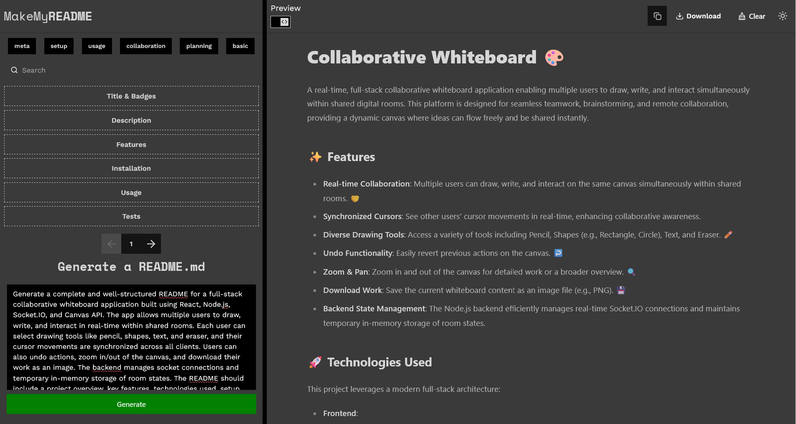
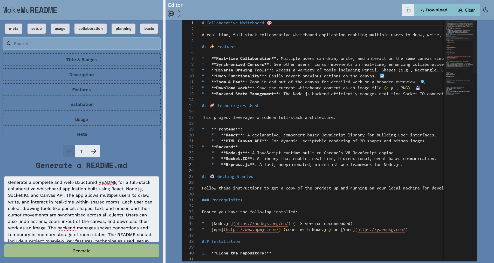

# make-my-readme ✨

## Description
`make-my-readme` is an intuitive web application designed to simplify the process of generating professional `README.md` files. Users can effortlessly create comprehensive READMEs by providing a single prompt, leveraging AI capabilities to structure and populate the content. The platform also offers a robust live preview, an integrated editor for fine-tuning, and a collection of premade templates to kickstart the documentation process. Once satisfied, users can easily download or copy their generated READMEs.

## Screenshot



## Features 🚀
*   **Prompt-based README Generation:** Generate a complete `README.md` from a single text prompt.
*   **Live Preview:** See real-time updates of your README as you edit or generate.
*   **Integrated README Editor:** Fine-tune the generated content directly within the application.
*   **Premade Templates:** Choose from a variety of professional README templates to get started quickly.
*   **Download Option:** Download your generated `README.md` file.
*   **Copy to Clipboard:** Instantly copy the README content to your clipboard.

## Technologies Used 🛠️
*   **Frontend:**
    *   Vite
    *   React (Vanilla JavaScript)
    *   TailwindCSS
*   **Backend:**
    *   Node.js
    *   Express

## Installation 💻

To set up the project locally, follow these steps:

### Prerequisites
*   Node.js (LTS version recommended)
*   npm or Yarn

### Backend Setup
1.  Clone the repository:
    ```bash
    git clone https://github.com/your-username/make-my-readme.git
    cd make-my-readme
    ```
2.  Navigate to the backend directory:
    ```bash
    cd server
    ```
3.  Install dependencies:
    ```bash
    npm install
    # or yarn install
    ```
4.  Create a `.env` file in the `backend` directory and add your environment variables (e.g., API keys for AI services if applicable).
    ```
    PORT=5000
    GEMINI_API=your-gemini-api-key
    ```
5.  Start the backend server:
    ```bash
    node --watch server
    ```

### Frontend Setup
1.  Navigate to the frontend directory:
    ```bash
    cd ../frontend
    ```
2.  Install dependencies:
    ```bash
    npm install
    # or yarn install
    ```
3.  Create a `.env` file in the `frontend` directory if needed (e.g., for API base URL).
    ```
    VITE_BASE_URL=http://localhost:3000
    ```
4.  Start the frontend development server:
    ```bash
    npm run dev
    # or yarn dev
    ```

## Usage 🚀
Once both the backend and frontend servers are running:
1.  Open your web browser and navigate to `http://localhost:5173` (or the port Vite is running on).
2.  Enter a prompt describing your project in the input field.
3.  Click the "Generate README" button.
4.  Review the generated README in the live preview.
5.  Use the editor to make any necessary adjustments.
6.  Choose to download the `.md` file or copy its content to your clipboard.

## Contributing 🤝
Contributions are welcome! If you have suggestions for improvements or new features, please feel free to:
1.  Fork the repository.
2.  Create a new branch (`git checkout -b feature/YourFeature`).
3.  Make your changes.
4.  Commit your changes (`git commit -m 'Add some feature'`).
5.  Push to the branch (`git push origin feature/YourFeature`).
6.  Open a Pull Request.

## Contact 📧
For any questions or inquiries, please reach out to:
*   Your Name - [your.email@example.com](mailto:your.email@example.com)
*   Project Link: [https://github.com/your-username/make-my-readme](https://github.com/your-username/make-my-readme)
